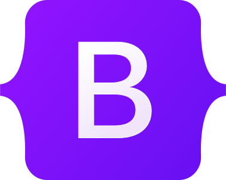
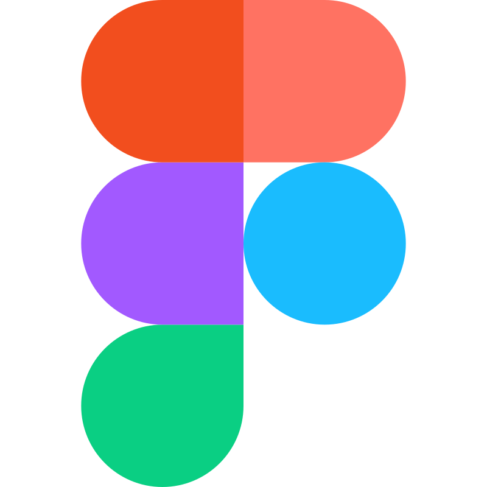

<!--
**jaissica/jaissica** is a ✨ _special_ ✨ repository because its `README.md` (this file) appears on your GitHub profile.

Here are some ideas to get you started:

- 🔭 I’m currently working on ...
- 🌱 I’m currently learning ...
- 👯 I’m looking to collaborate on ...
- 🤔 I’m looking for help with ...
- 💬 Ask me about ...
- 📫 How to reach me: ...
- 😄 Pronouns: ...
- ⚡ Fun fact: ...
-->

## Hey, I'm Jaissica

 

## About Me 🚀

- 🔭 I'm currently gaining valuable experience as a Software Engineering Intern at EnergySage, Inc.
- 🌱 At the moment I'm working on Vue, Nuxt, Django and Python.
- 🎓 I'm currently MSCS student at Northeastern University
- 👯 I’m looking to collaborate on Web Development and Data Science projects.
- 💬 Ask me about Web Developement and Data Visualization
- 😄 Pronouns: She/Her/Hers
- 📫 How to reach me: hora.j@northeastern.edu

I am experienced in Full Stack Web Development, Data Engineering and Visualization. I am interested in learning about new technologies and frameframeworks.

## **Languages and Tools:**  

<strong>Programming Languages</strong> 
  

  

<strong>Frontend Development</strong> 

<strong>Backend Development</strong> 

<strong>Database Management</strong> 

<strong>Data Science and Visualization</strong> 

<strong>Cloud Services and Infrastructure</strong> 

</a>

<strong>Testing and Other Tools</strong> 

<table cellpadding="8" cellspacing="8">
  <tr>
    <td></td>
   </tr>
</table>
